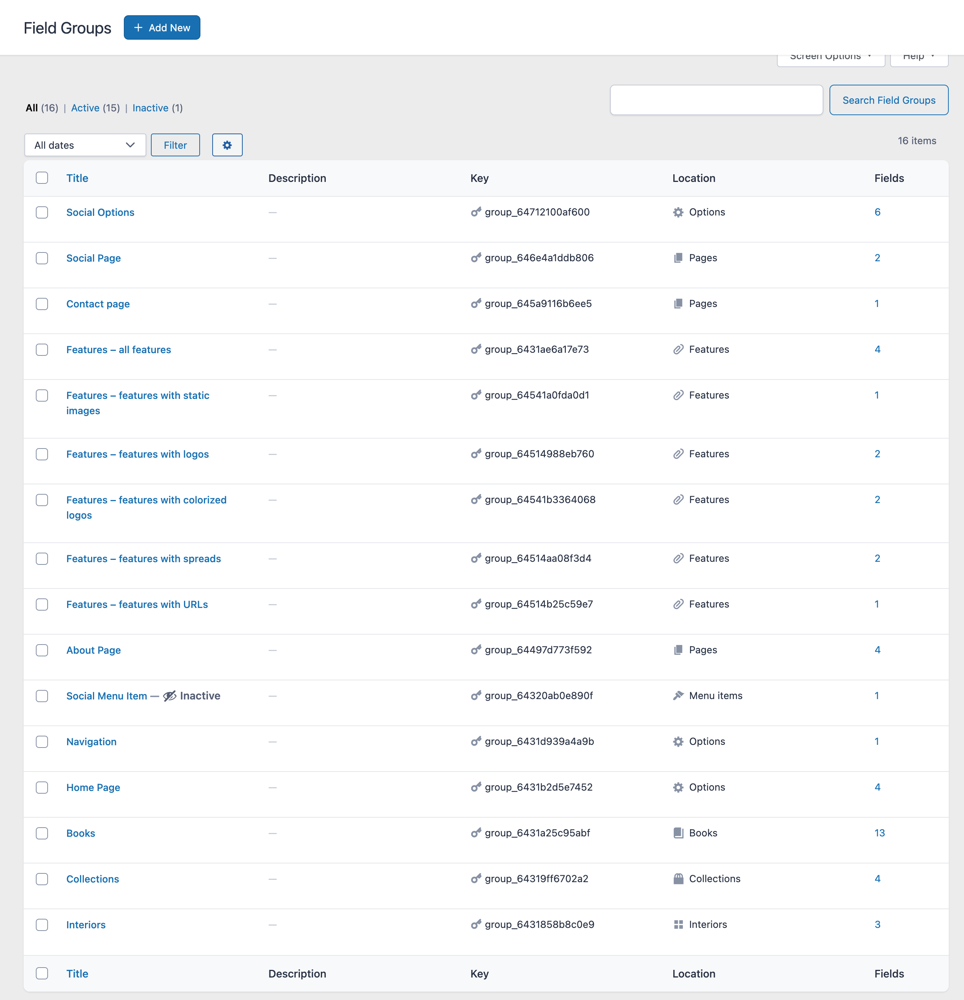

# Wordpress Theme for client codenamed C.A.C.

This is a bespoke wordpress theme created for a single client. They were concerned that someone would see their site and go looking for their theme to rip off, so I only have permission to publicize a copy of the theme with their name removed.

## Tech

- [Them.es](https://them.es/starter-bootstrap/) Bootstrap starter theme
- Gulp removed, Vite added
- Vue 3 added for what turned out to be just one component.
- GSAP for logo animation
- SCSS for everthing else
- Bootstrap stripped WAY down to just a few things- breakpoints, grid, type, forms
- Required WP plugins
  - Advanced Custom Fields
  - ACF Focus Point
  - Spotlight Instagram feeds

## Custom Post Types and Custom Fields

- Interiors are the equivalent of portfolio pieces in this industry
- Features are press articles, but there are 4 different types, each with its own view logic
- Books are the client's published books, which we promote on the site
- Collections are collaborations between the client and various furniture companies
- Between all those, the homepage, and a few other spots, there are 51 custom fields

Again, I'm not going to give away my client's secret sauce, but here's a vague screenshot to give you a sense of what this site needs.

